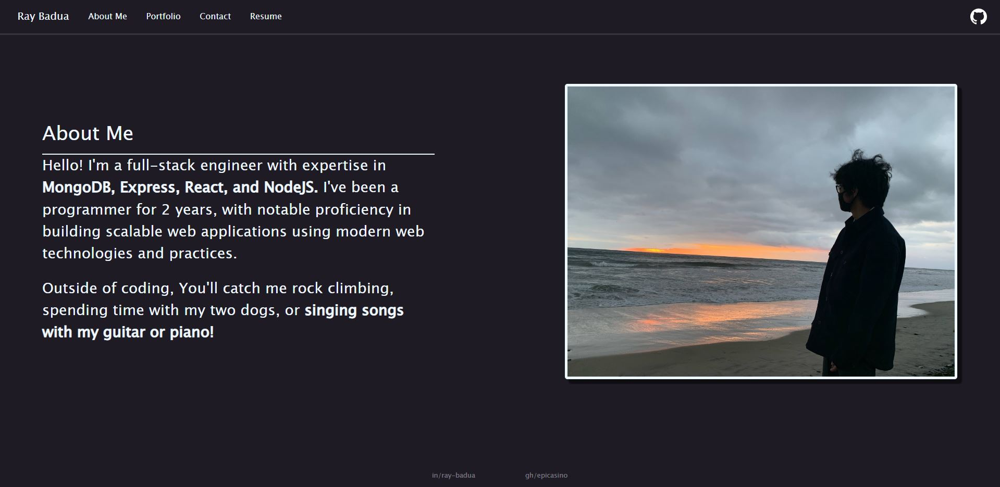
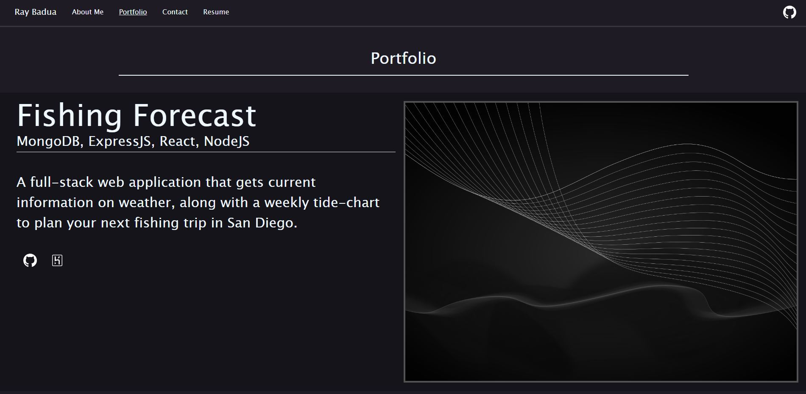
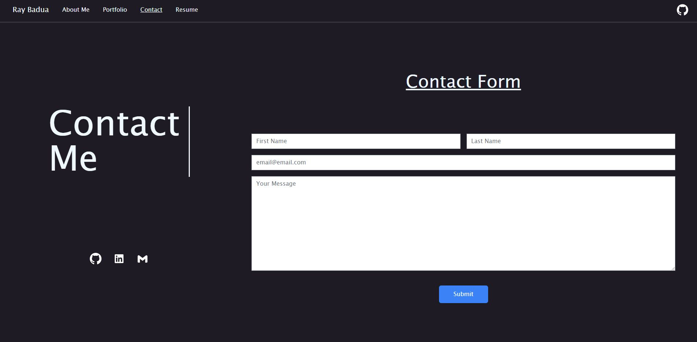

# [Ray Badua: Portfolio](https://raybadua.netlify.app/)

## Description

Provide a short description explaining the what, why, and how of your project. Use the following questions as a guide:

- A front-end portfolio built with React, and styled with Tailwind.
- This portfolio also implements react-router-dom to create a multi-page, interactive portfolio with CSS animations.
- With this project, I can showcase my proficiency in React, along with showing potential job prospects my skills as a modern front-end web developer.

## Installation

**Application deployed in Netlify. [Click here to access portfolio](https://raybadua.netlify.app/).**

## Usage

Upon first accessing the portfolio, you will be presented with the 'About Me' section in the application.

On the top of the application, there is a navbar with different pages in the portfolio, along with a GitHub icon on the top right, which redirects the user to my GitHub profile.

When clicking on the 'Portfolio' tab on the navbar on the top, you will presented with a series of projects.

When clicking on the 'Contact' tab on the navbar, you will be presented with a set of icons for contact information, along with a functional contact form.

## Credits

[Styling utilities made possible with TailwindCSS.](https://tailwindcss.com/)

## License

MIT License

Copyright (c) 2023 Ray Badua

Permission is hereby granted, free of charge, to any person obtaining a copy of this software and associated documentation files (the "Software"), to deal in the Software without restriction, including without limitation the rights to use, copy, modify, merge, publish, distribute, sublicense, and/or sell copies of the Software, and to permit persons to whom the Software is furnished to do so, subject to the following conditions:

The above copyright notice and this permission notice shall be included in all copies or substantial portions of the Software.

THE SOFTWARE IS PROVIDED "AS IS", WITHOUT WARRANTY OF ANY KIND, EXPRESS OR IMPLIED, INCLUDING BUT NOT LIMITED TO THE WARRANTIES OF MERCHANTABILITY, FITNESS FOR A PARTICULAR PURPOSE AND NONINFRINGEMENT. IN NO EVENT SHALL THE AUTHORS OR COPYRIGHT HOLDERS BE LIABLE FOR ANY CLAIM, DAMAGES OR OTHER LIABILITY, WHETHER IN AN ACTION OF CONTRACT, TORT OR OTHERWISE, ARISING FROM, OUT OF OR IN CONNECTION WITH THE SOFTWARE OR THE USE OR OTHER DEALINGS IN THE SOFTWARE.
